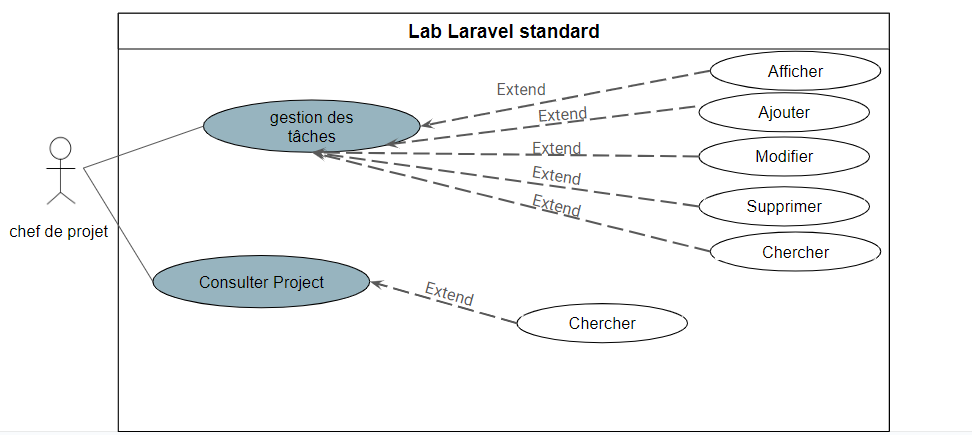
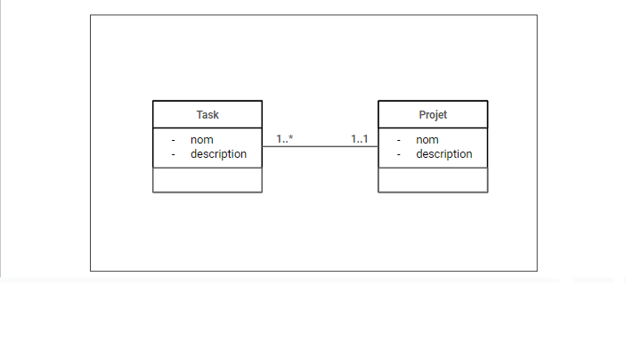
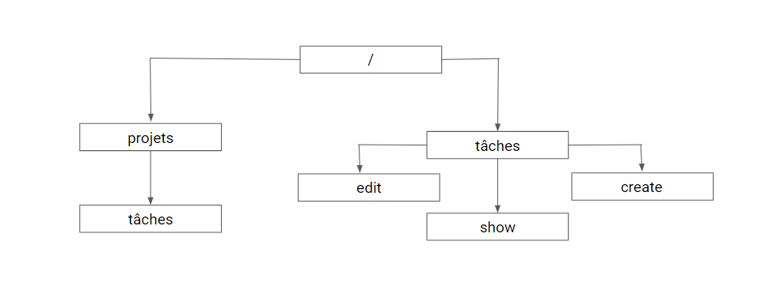
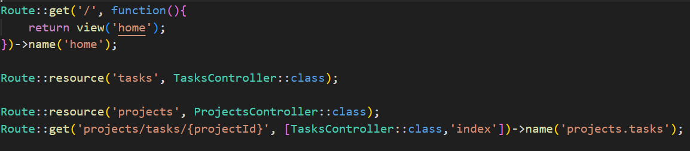
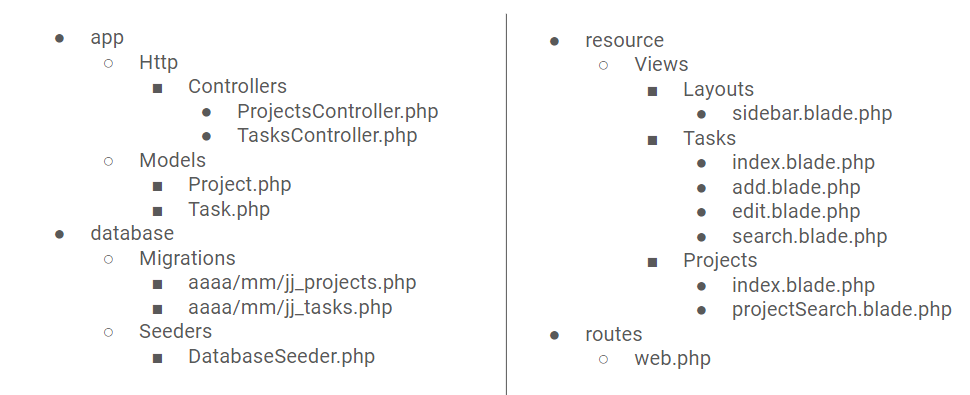

# Lab CRUD laravel Standard

## Analyse

- Cas d’utilisation détaillé

## Conception

- Diagramme De Classe

## Plan de site web

- Plan de site web

- Routing
  

  
- Structure d’application

## Réalisation

- ['Lab CRUD Laravel Standard'](https://github.com/grain03/lab-laravel-crud-standard)
