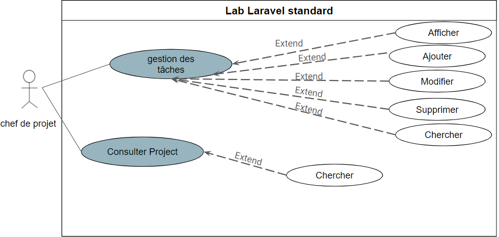

<!-- new slide -->

# Analyse
<!-- new slide -->
## Empathie map 
<!-- new slide -->
## Définir le probléme
{:width="500px" }
*Définir le probléme*
<!-- note -->
Après avoir réalisé un lab Laravel CRUD basique, il est devenu évident qu'une version plus avancée, appelée CRUD standard, est nécessaire pour répondre à des exigences fonctionnelles plus complexes. 
Ce nouveau lab doit intégrer des fonctionnalités avancées telles que la gestion : 
 - validation de formulaire
 - La pagination
 - La recherche
 - La gestion des images,
 - Les relations Eloquent plus complexes comme les relations Many-to-Many et Polymorphiques.
  

<!-- new slide -->
## Idéation 

{:width="500px" }
*Idéation*
<!-- note -->
L'objectif est de fournir une application CRUD standard pour expérimenter et comprendre les concepts fondamentaux de Laravel tout en mettant en œuvre des opérations de base sur une entité de données.

<!-- new slide -->
## Diagramme de cas d'utilisation

 {:width="500px" }
*Diagramme de cas d'utilisation*

