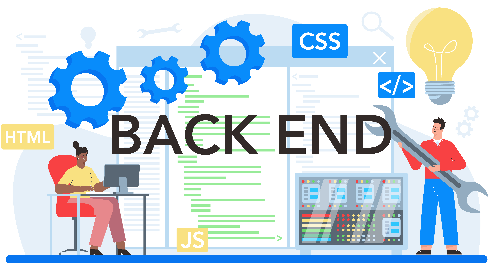

# Projets backend

{:width="700px"}


<!-- note -->

Dans la section dédiée aux projets, nous élaborerons une plateforme pour la gestion efficace des projets, démontrant ainsi notre expertise en Laravel. Cette démarche nous permettra de mettre en pratique nos compétences en développement back-end, tout en garantissant une approche professionnelle et efficace dans la gestion de nos projets.

## Les command

installer composer

```bash
composer install
```

Création de namespace projets dans controller et le fichier projetController

```bash
php artisan make:controller projets\projetController
```
Création de namespace projets dans model et le fichier projet avec le migration

```bash
php artisan make:model projets\projet -m
```

Création de namespace projets dans request et le fichier projetRequest pour valider les inputs

```bash
php artisan make:request projets\projetRequest
```

Création de repositories dossier

```bash
mkdir Repositories
```

Création de fichier de AppBaseRepository.php

```bash
echo > AppBaseRepository.php
```

Création de fichier de ProjetRepository.php

```bash
echo > ProjetRepository.php
```

Création de ProjetsSeeder seeder

```bash
php artisan make:seeder projets/ProjetsSeeder
```

Command pour inserer projets info sur base donnée en utilisant seeders

```bash
php artisan db:seed --class=Database\Seeders\projets\ProjetsSeeder
```

<!-- new slide -->
